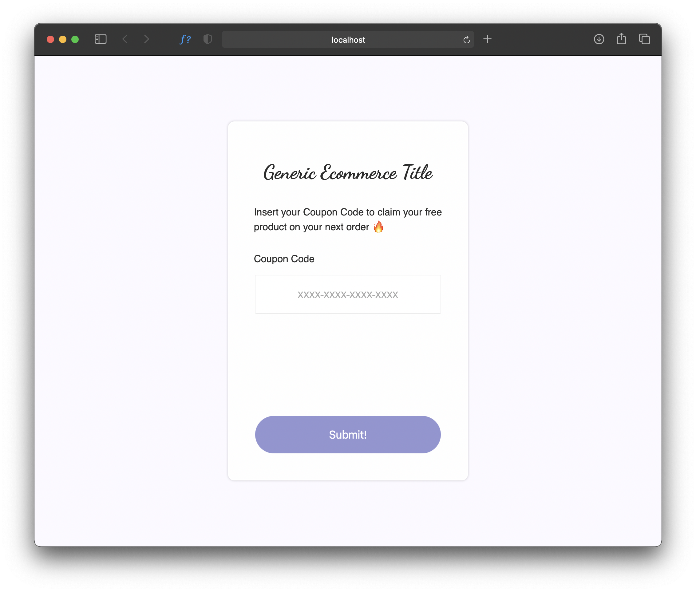

# Daily UI #061

>“Imagine that it's time for someone to redeem a coupon.
It could be via an in person self-checkout screen or on a website.
Think about the requirements of a coupon such as the discount percentage, the subtotal, total, and other unique features.“

### Tech Stack
React, Jest, Styled Components.

### Solution

Not a pretty one tbh (white spaces, fonts, colors... ugh... orrible.), but i'm focusing more on the TDD aspect of it for now and don't care much about the layout as long as it works... To be fair, i'm not a graphic designer.
